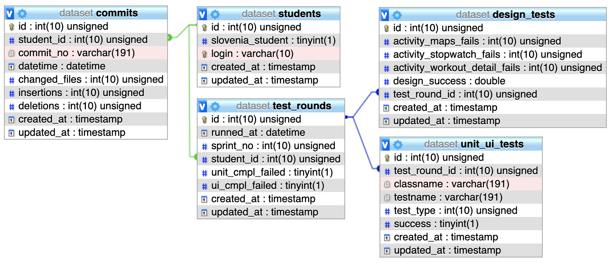

# Observation of Students Behaviour in Programming Courses with an Automated Testing Platform at Differently Geolocated Universities: A Case Study
This project is part of the scientific paper [Observation of Students Behaviour in Programming Courses with an Automated Testing Platform at Differently Geolocated Universities: A Case Study](https://madeja.github.io/publications/19-aei-smart.pdf) published in [Acta Elekcrotechnica et Informatica (AEI)](http://slate-conf.org/2019/).

## Data
Project includes [MySQL dump](./dataset.sql) of analyzed data which can be used for other analysis. Database schema is as following:

### Tables

- **commits** - Commits of particular students.
- **students** - List of students with his/her base info.
- **test_rounds** - Every student has own test rounds due to changes between submissions.
- **design_tests** - Test results of layout check (Android XML layout files).
- **unit_ui_tests** - Test results of unit and UI tests.

## Acknowledgements
The authors would like to thank all the participants in the research, especially students and teachers of courses \textit{Application Development for Smart Devices} at Technical university of Košice and \textit{Platform Based Programming} at University of Ljubljana. This work was supported by project KEGA No. 053TUKE-4/2019: Learning Software Engineering via Continues Challenges and Competitions.